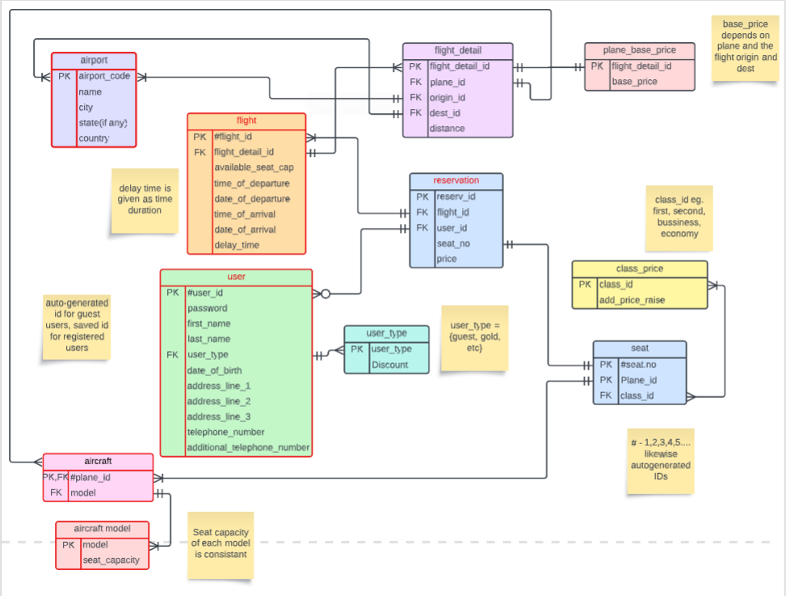

# DBMS (CS3043) - MiniProject

## Basic Idea

Here we have designed a airline reservatiion system for an imaginary airline company to manage flights and flight reservations.
We try to add two UIs,  
1. for users to book flights and see flight details
2. for admin section to see reservaion details and flight details 

We are trying to build this without using any pre-built libraries and frameworks.

**You will need to use XAMPP server to run and see this code.**

## Project Structure

### mySQL database

we added 11 tables to work out whole system.

1. aircraft - here we keep details about all planes 
2. aircraft_model - using this table to track seat capasity of each plane
3. airport - details about each airports where the company manages flghts
4. class_price - there are three classes according to the services company supply, choosing higher tier class will add a price raise to the base price of the flight
5. flight - details about scheduled upcoming flights by the company
6. flgiht_detail - detail about flights planned between each aiport and plane using for them
7. base_price - base price for each flight, depends on distance and also plane using for the journey
8. reservation - details about reservations done by users
9. seat - class and plane of each seat belongs
10. user - details about registered users
11. user_type - user types (gold, frequent, guest) and their speacial discounts

### php structure

In admin side we added CRUD operations to all tables mentioned above. CRUD operations of reservations table is responsibility of client side.

contact : kumudu.20@cse.mrt.ac.lk for anything regarding to this.
           
